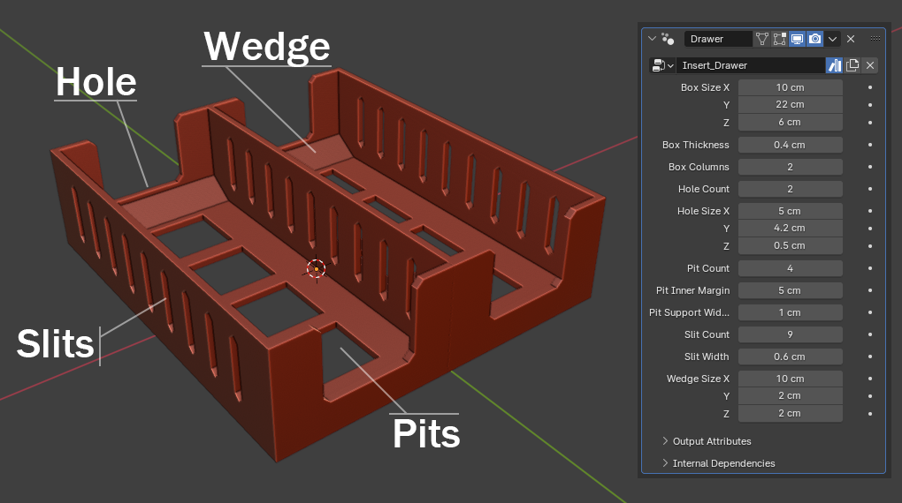
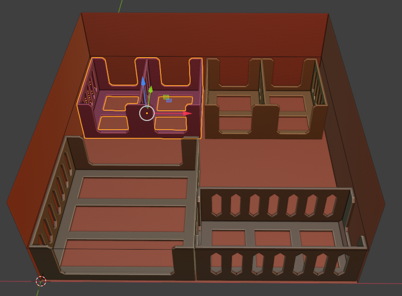
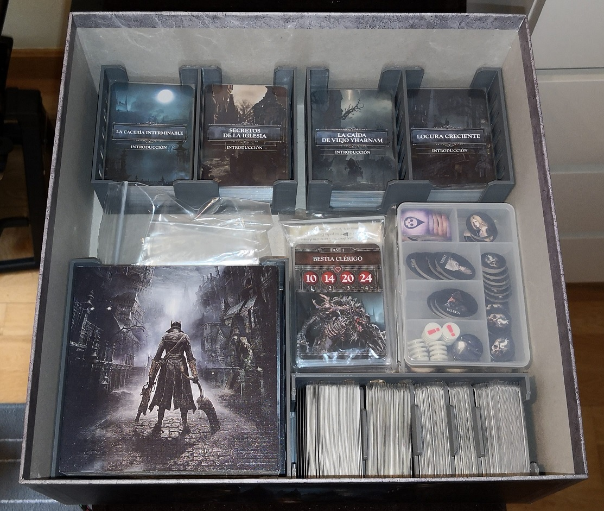

# Board Game Inserts
Blender templates to build printable boardgame inserts.

The magic happens in **InsertsTemplate.blend** in which I've created a few *Geometry Nodes* that allow me to procedurally create the insert.

Then I've uploaded some inserts that I've been printing successfully with an *Ender 3 v3 SE*. You can use those as a template on how to build you own inserts.

## Workflow

Download the the whole thing and duplicate one of the inserts. You could do it from scratch, but why would you, as some setup is already done for you.

Also, remember that all **distances are in centimetres**.

If you want to duplicate a drawer, I suggest using Alt+D to not create a new mesh, but just a new 'object' (with the same mesh). Everything is created procedurally so no new meshes are needed.

To export, I use the **3D Print Toolbox** addon inside blender, you should already have it, but you need to activate in *Edit > Preferences > Add-ons*.

I just export as-is, when importint the STL into the slicer (I use the default Creality Print for now, it works fine for me), it usually asks to resize the model, just click YES and it should be the right size.

## Geometry nodes

### Insert_Drawer

- **Box Size:** is the cube outer size (width, depth, heigh)
- **Box Thickness:** self explanatory, remember the box size is the outer size, so you would *carve* the thickness inside it.
- **Box Columns:** If you want to replicate the same setup side by side (like in the preview)

- **Hole Count:** Holes are the front-back *doors*. You can have none, just one in the front, or front and back.
- **Hole Size:** Width and Height of the holes, the Z parameter is the bevel size.

- **Pit Count:** The bottom holes. You can have none if you want.
- **Pit Inner Margin:** The inner border of the pits.
- **Pit Support Width:** Width of the supports between pits. You can make them thinner/thicker if you want.

- **Slit Count:** Slits are the vertical holes at the sides which are mostly to print less material. It hses the **Pit Inner Margin** to set the start-end position of the slits placement.
- **Slit Width:** Width of each slit.

- **Wedge Size:** The wedge is the bottom sloped floor that you can see at the back of the picture. You can make that the whole floor if you want. It's meant to help pickup the cards/tokens inside. The size is width, depth, height as usual. If any of these is zero, the wedge disappears.

### Insert_Divider

- **Size:** Width, Height and Depth (thickness) of the divider.
- **Bevel:** Amount of bevel in the corners.
- **Inset:** Thickness of the inset border as the geometry is meant to be mostly hollow.

- **Tab Height:** Height of the upper label. It can be zero if you want no label.
- **Tab Width:** width of the upper label. It's also used to place the supports.

- **Support Count:** Amount of supports below the Tab. They can be zero.

# Examples:

